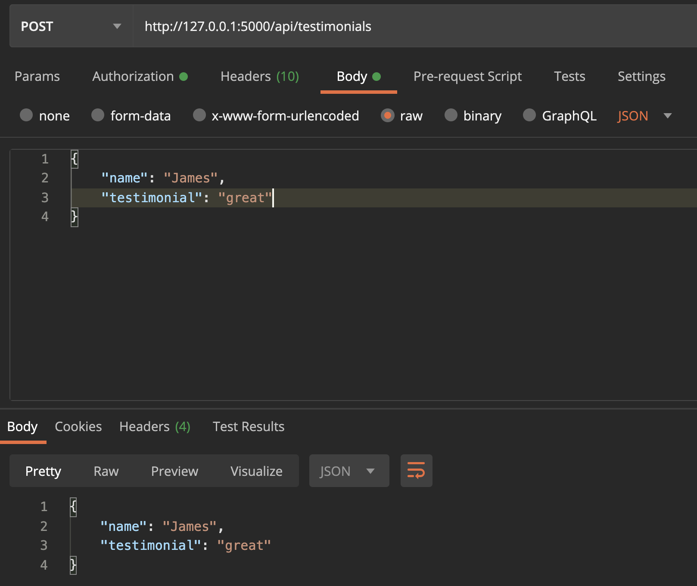

## Creating and Reading from an API

In this session we will be talking about the first two components of CRUD (create, read, update, delete).

This is going to be fairly straight forward as we already created an option to read data from our database in the previous video. This was available at ```/api/testimonials```.

Now, let's add the option to get a specific testimonial.

First, visit ```http://localhost:5000/api/testimonials``` to get the ID of the testimonial (its most likely 1).

Now, visit ```http://localhost:5000/api/testimonials/1```. Right now the page is not working, obviously. Let's create that endpoint.

```
@app.route('/api/testimonials/<id>')
def get_testimonial(id):
    return jsonify(Testimonial.query.get(id))
```

This will give us this response:

```
{
  "id": 1,
  "name": "Claire",
  "testimonial": "saved my job"
}
```

Now, an invalid ID will result in ```null```. This can work, but instead I'll return an empty dictionary.

```
@app.route('/api/testimonials/<id>')
def get_testimonial(id):
    testimonial = Testimonial.query.get(id)

    if testimonial:
        return jsonify(testimonial)

    return {}
```

With templates I returned a 404 page when the resource wasn't found. For an API I like to return an empty dictionary.

## Creating Data

For create, we will use a ```POST``` request and I recommend the use of [Postman](https://www.postman.com/).

We can start our route like this:
```python3
from flask import request

@app.route('/api/testimonials', methods=['POST'])
def add_testimonial():
    return request.get_json()
```

This doesn't give us the final result, but it does show us how to get the data sent in through Postman. It will repeat it back in the response.



This means that all of the data in the body is accessible through a dictionary retrieved from ```request.get_json()```.

Let's finish our endpoint:

```
@app.route('/api/testimonials', methods=['POST'])
def add_testimonial():
    data = request.get_json()
    testimonial = Testimonial(name=data.get(
        'name'), testimonial=data.get('testimonial'))
    db.session.add(testimonial)
    db.session.commit()
    return jsonify(testimonial.id)
```

When we execute ```db.session.commit()```, the id is added to the object in ```db.session.add()```. This means we can access the newly added id with ```testimonial.id```. This is the ideal return value as it gives us a unique number to work with row in our database directly, if needed.

## Checking all of the records

Now that we have postman, we can easily switch the method to ```GET``` to see all the data while leaving the request body as is. It is ignored with our GET endpoint.

## Deploying Our changes

Let's commit these changes and confirm they work on our server.

Something like ```GET http://flaskpractice-env.eba-xy339akp.us-east-2.elasticbeanstalk.com/api/testimonials```

We can add data and confirm that it's working!

