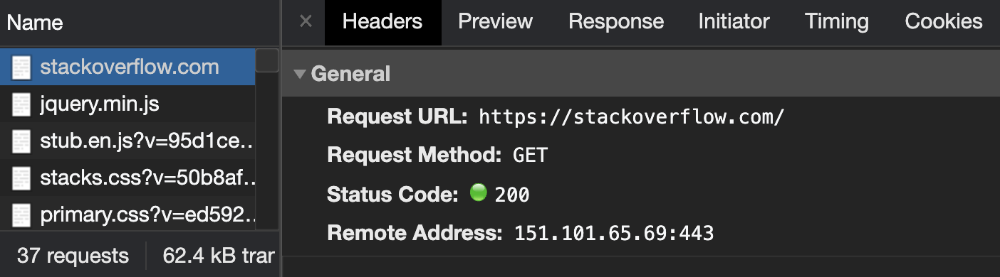
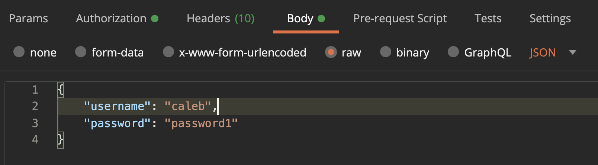

# A Brief but Important Overview

Before we start coding, I want to take another lesson to look at the big picture. This will allow you to better understand why we are doing things the way we do and might reduce the number of new concepts you have to learn when we get to more challenging lessons.

Don't feel like you have to understand all of these perfectly. It's not possible because we are not coding anything in this video. Just get a general idea.

## 1. Source Control

Source control is a system to store your code, protect it, and preserve version changes.

The most common tool for this is [Git](https://git-scm.com/), and then storing this code online using [GitHub](https://github.com/). That's what we are going to do, but you can use other tools as well.

This is the most important step to starting a software project. There's no realistic way to scale and protect your code without a good system for managing your source code.

Throughout these lessons we will talk about what code should and should not be checked in to source control (you can set ignore rules using a ```.gitignore``` file...more on that later.

GitHub allows for free private repositories, so if you want to protect your code from disappearing when your computer explodes, but don't want to open your code for everyone to view, you can give that a try.

## 2. Virtual Environments

Virtual environments are a setup step that we must perform that, at first, can be a little annoying and distracting from learning Python or web development.

However, virtual environments have a very important purpose.

Virtual environments allow us to isolate our application dependencies from other Python applications on our machine. This means that we can install dependencies *just* for this project. For example, we will install the Flask dependency, Jinja, etc, all in a virtual environment for our project.

Why is this important?

Well let's say you have a project using a dependency that is on version 2, and you start building a new website on version 3. You don't want to update this dependency for every application on your machine, potentially breaking older applications or team projects.

It's important that everyone developing the web application with you has all of the same package versions to ensure the application code works the same for all developers.

And even if you're not working in a team environment, you may make your project open source or need to download your own code years in the future. We want it to work consistently in all scenarios.

That's made possible with a [**virtual environment**](https://docs.python.org/3/tutorial/venv.html). If you're new to this concept, it's important to know that this is Python thing, not just a Flask thing.

You can store a virtual environment pretty much anywhere on your machine, but to me it makes the most sense to store it in your project directory in a hidden folder. I'll typically call it ```.venv.``` Some people prefer to store all of their virtual environments across projects in a separate folder, but I'm not a huge fan.

In the terminal open to the project directory, you can create a virtual environment called ```.venv``` with:

```
python3 -m venv .venv
```

The ```.venv``` folder does not need checked in to source control because we will preserve the package versions in a specific file called ```requirements.txt```.

## 3. Requirements.txt

When we create our project, we can define the modules we depend on in a text file. We can then later download all of the dependencies at a later time and get the exact version numbers that we need.

This is done in a file called ```requirements.txt``` and is checked in to source control.

The dependencies can all be restored using the requirements.txt file, so we don't need to store the actual dependency code itself (it's all available to download using PIP from the [Python Package Index](https://pypi.org/)). This is why checking in the ```.venv``` file is often unnecessary unless you really want to be sure all the dependency code is checked in (say if, a particular package version became no longer available for download at some point in the future).

we download dependencies using pip, and you can generate a ```requirements.txt``` by saying:

```
pip freeze > requirements.txt
```

Whenever you want to generate your dependencies from ```requirements.txt```, with an activated virtual environment, run:

```
pip install -r requirements.txt
```

## 4. Deployments

This is a topic that deserves its own course (probably from someone more qualified than myself), but I can say that deployment is a very important step in a software project.

Because we are building a web app, we will be deploying to a web server that we can access through the browser.

In this day and age, I never recommend self hosting unless that's something you're passionate about. Instead, I recommend finding a good cloud provider that you're interested in learning more about and deploy your application there.

For me, that's Amazon Web Services, but there is a lot of competition out there so I'm sure there are more options.

I chose AWS because I'm most familiar with their platform from when I was a web developer. Also, AWS has a wide variety of services, so I can learn one platform and achieve many results.

I have a little bit of experience with some other platforms such as Microsoft Azure, but I really think that environment is set up best if you're working with an ASP.NET application.

We'll be using a very basic code pipeline that deploys our GitHub main branch to a web server in AWS. A little complicated to set up, but very convenient when developing with an end product in mind and if you want to check to make sure the software works in deployment every now and again.

Basically the workflow would be:

```
code locally > commit changes > push to centralized location (GitHub) >
automatically trigger deployment > confirm changes on deployment server
```

We're going to do the deployment fairly early instead of waiting till the end. That way we can reference it as we build up our application. If you have any hiccups deploying your application (I see it as the most likely thing to change in this course material) or don't need to deploy, you can follow this series on your local machine pretty much the same.

## HTTP Methods

A web server is going to not only allow requests to certain routes (```/api/users``` for example), but also different **methods**. A comprehensive list can be found [here](https://developer.mozilla.org/en-US/docs/Web/HTTP/Methods), but the main few you should first become comfortable with are ```GET``` and ```POST```.

```GET``` requests are typically used to request (or get, as the name would imply) data from the server. An example would be ```GET /api/users``` to retrieve a list of users from the web server.

When we visit a web page on the internet, this is the HTTP method used.



With this method, we can pass in additional needed information in a **query parameter** attached to the URL. Anything after the path is likely a query parameter.

```
GET /api/users/?first=elizabeth&limit=10

```

or URL for a search on Stack Overflow (similar for Google):

```
https://stackoverflow.com/search?q=python+not+working
```


Because the query parameters are directly attached to the address, they are not designed for sensitive data.

```POST``` requests are typically used to add or update data on the server. This method is often used when you submit a form on a website such as a login or a payment. Or if you are adding some new data (like a new comment on social media).

When working with forms that have sensitive data, We will this data to the request in the **request body** instead of the URL.



We can test POST requests and all things APIs using [Postman](https://www.postman.com/).

This data gets encrypted when using **HTTPS** (HTTP secure). This is exactly the reason why submitting sensitive data to a website that is only using HTTP and not HTTPS is a security risk. with HTTP (not HTTPS), request headers and body are unencrypted, potentially being hijacked and read by human eyes.

## Up next

So far we have the basic concepts understood. I believe getting a good conceptual overview first can help make the coding experience a lot smoother, but because you might not have any hands on experience to associate this content with, you may need to come back and watch after you get some practice.

We are going to do one more video on concepts, and then we'll set up our project!
