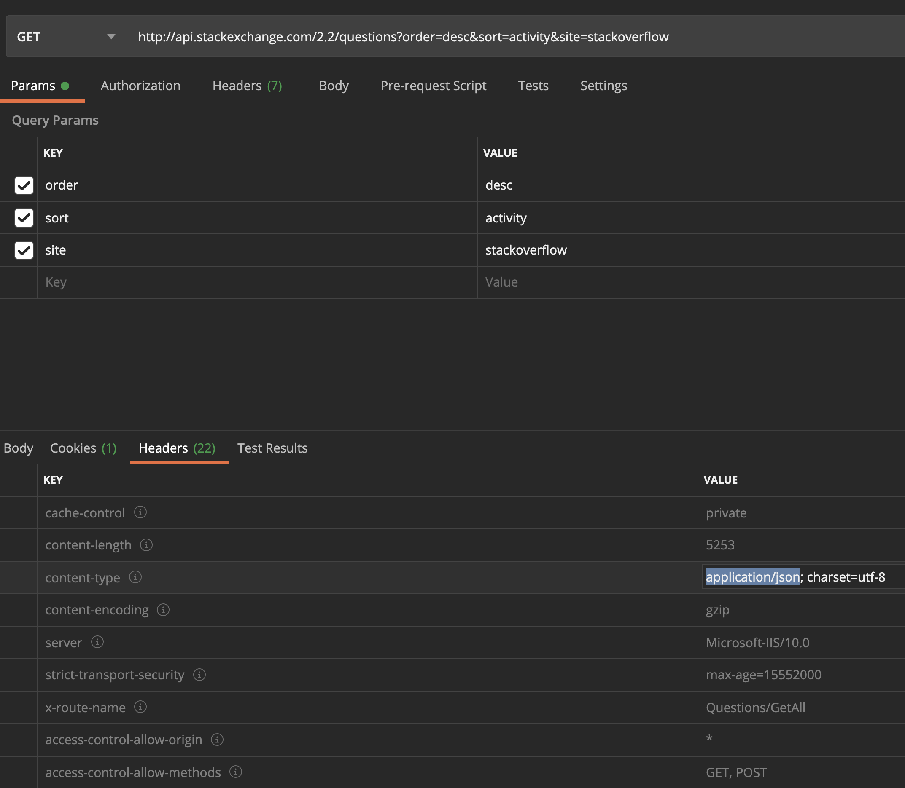

# A Brief but Important Overview...part 2?

Previously we talked about the basics of how a Python web development project will be setup as well as the most common request types.

Now, I want to talk about some more concepts.

## Responses

With each request we get can respond with data. such as a response status code, headers, and a body.

If you ```GET``` a list of users, you'll likely get that in the response body.

if instead you ```POST``` a new user, you might get something like the new users ID, or a confirmation message saying that the user was created successfully.

In addition to the body, there are **status codes**.

When we open our web browser and make a request to a web server, the web server responds. This is typically a status code ```200 OK```, which means everything worked fine, but there are a bunch of other [status codes](https://developer.mozilla.org/en-US/docs/Web/HTTP/Status).

Another common one you might see is ```404 NOT FOUND```, which means the particular page you are looking for cannot be found.

A third popular one is ```500 INTERNAL SERVER ERROR```, which means there has been an error on the server and the page can't be delivered. Something with the web application isn't working, but we weren't given any details.

As the web developers, we have the ability to choose the content type that is given back to the client in response to a request. This is defined in a header called **Content-Type**.

Two of the most common content types you will see from web apps are ```text/html``` and ```application/json```. The first is the typical response if the client is requesting a web page and the second is if the client is requesting JSON.



In flask, we can return HTML by invoking ```render_template()``` for a route and then returning the result. That is if you're using templates as we spoke about in the first lesson.

alternatively, we can return JSON by invoking ```jsonify()``` with some data and returning the result. This is what we'll be using to build our API and return JSON.

We'll get into the details later.

## Databases

Databases give us the ability to persist data between website visits.

Python actually ships with a database, **SQLite**, which is extremely convenient! Python has made it easier than ever to start working with databases. It takes like .02 seconds to get started.

SQLite is amazing because it's very light weight and can easily ship with your software without requiring a dedicated database server. SQLite is said to be an embedded database and it just ships with your Python code.

That being said, SQLite is not typically the database of choice for web applications, for two reasons:

1. You don't need an embedded database with a web application, because everyone using your web application visits in a centralized location.
2. SQLite is not designed to be massively scalable and may introduce some limitations into your application.

That being said, SQLite is not as limited as people make it seem. Even the [SQLite website](https://sqlite.org/whentouse.html) handles millions of requests a month while being powered by SQLite.

Regardless of your opinion on SQLite, I don't believe it's the best intended tool for the job or what you would expect to find in a real world project. Thus, we are going to use Postgres.

Postgres is an open source relational database and in terms of use is going to be pretty much the same as MySQL, SQL Server, or any other relational database. If you're looking for an unstructured database, you could try MongoDB.

## SQLAlchemy and ORMs

SQLAlchemy is an example of an **ORM** (object relational mapper). The purpose of SQLAlchemy is to abstract away SQL from the developer so we can focus on application development and not database development.

AN ORM will essentially take a bunch of rows of a database table and convert them into a collection of objects that match the database structure.

There is a SQLAlchemy module specifically for Flask called [Flask-SQLAlchemy](https://flask-sqlalchemy.palletsprojects.com/en/2.x/) (shocking, right?). Instead of writing SQL (which may change from database to database), you can grab all the rows of a database table with a Python statement as simple as ```User.query.all()```.

## Authorization

As we build out our API, we may want restrict certain access to certain people. Maybe you want to build out an admin panel with more capabilities, or only allow registered users to use the API. This is all included in **authentication* and **authorization**. Authentication is confirming your identity, and authorization is confirming your permission levels.


## Secrets
1. response (template or JSON-dictionary automatic)
1. database, sqlite, postgres
1. sqlalchemy, ORM, and models
1. Authorization and authentication
1. secrets / hiding connection strings
