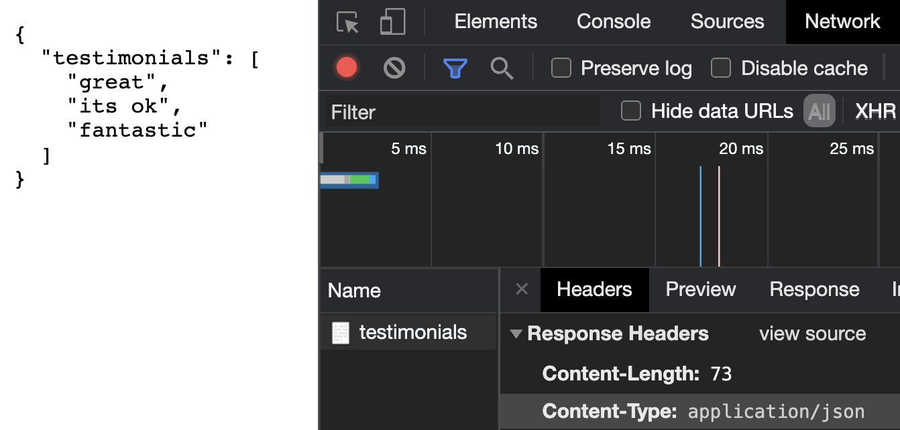
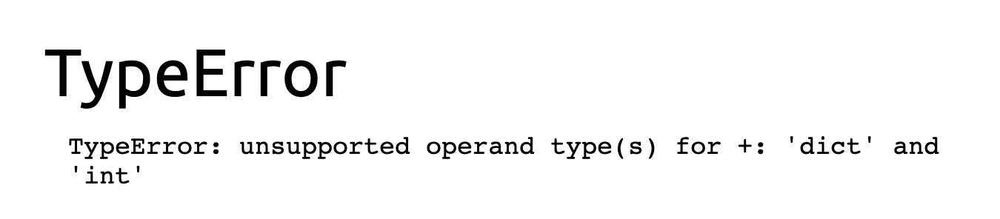
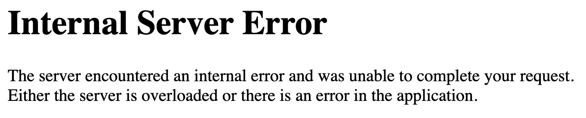

# Getting started with Flask

Ideally for this episode you have some basic Python experience. You already have it installed, know how to run a python file, etc.

It would be nice too if you knew the basics of working with pip, although it's not too bad :)

The process will look like this:

1. create a project directory
1. Set up a virtual environment
1. Activate the virtual environment
1. Install necessary packages for our project
1. Create a requirements.txt
1. Create a hello world flask application on our local machine

Throughout this getting started guide, you can refer to the quickstart page [here](https://flask.palletsprojects.com/en/1.1.x/quickstart/).

## Setting up the Environment

I like to create my virtual environment in my project folder, but it is possible to have it outside of the project structure.

For these upcoming commands, you'll want to use the correct name for python. If you're unsure, try each of these in the terminal:

```
py --version
python --version
python3 --version
```

You'll want to use whichever works and is Python version 3+. If none work, you'll want to go install Python.

```
python3 -m venv .venv
source .venv/bin/activate
```

Now you can type ```python3 -m pip --version``` (using the correct name for python, as mentioned earlier) to confirm you have pip installed. If not, you'll want to [install it](python3 -m pip --version).

You may be able to invoke pip directly using ```pip``` or ```pip3```.

Let's finish setting up our project.
```
pip3 install flask
pip3 freeze > requirements.txt
touch application.py
```
You'll likely want to invoke freeze anytime you install new packages. This way, the requirements.txt is up to date.

Remember the requirements.txt is the file used to install all packages when you download the project for development in a new environment with ```pip install -r requirements.txt```.

Now, inside ```application.py```:

```python3
from flask import Flask

app = Flask(__name__)

@app.route('/')
def index():
    return "Hello!"
```

To run the application, we set some environment variables (use set on windows):

```
export FLASK_APP=application.py
export FLASK_ENV=development
flask run
```

This will give you an IP address and URL to visit ([http://127.0.0.1:5000/](http://127.0.0.1:5000/)). You'll need to make sure the server is running anytime you visit this web page.

You’ll need to do these exports every time you start your terminal window. So always make sure to:

1. Be in the right directory
1. Activate your virtual environment
1. Run your exports

## A quick note on the development server

This is going to start a development server where you can test your code locally.

This is not a server designed for deployment. You'll want to find a more dedicated server software to deploy your application such as **NGINX** or **Apache**.

On top of this, I would recommend running your application on a server service offered in the cloud, such as **AWS** or **Heroku**.

The development server is part of a package called **Werkzeug**, and is mentioned first thing in the [Flask documentation](https://flask.palletsprojects.com/en/1.1.x/).

The flask docs call [**Werkzeug**](https://werkzeug.palletsprojects.com/en/1.0.x/) a WSGI toolkit. Essentially a library offering WSGI utilities. Which means absolutely nothing unless you know what WSGI is. I'm not an expert in this area, but WSGI is just a convention for how web servers in Python work, so that the wide array of Python web development frameworks (flask, Django, etc) can run on any server software as long as WSGI is supported.

It may also be helpful to know about [**ASGI**](https://asgi.readthedocs.io/en/latest/), which is the successor of WSGI and is supported in a lot of frameworks like Django, FastAPI. The primary difference being that ASGI is built for Asynchronous web.

## An overview of the code

The first thing you should notice is that the actual code in our flask application (so far) is extremely thin. This is why I appreciated Flask so much.

That being said, It can still be confusing because a lot is going on in these few lines of code. Let's go over each piece.

```from flask import Flask``` brings the Flask class from the flask module in to scope. This allows us to use the module in our code. This is a pretty standard practice in Python.

```app = Flask(__name__)``` is a bit more cryptic. This is the syntax to make a new object from the Flask class and we are assigning it to the variable ```app```. The ```__name__``` refers to the name of our application module. This will have the value ```__main__``` when we run our application directly.

This concept took me some time to wrap my brain around, so it helped when I isolated this concept in a simple Python file. Although if you're just starting out, this may be something best studied after some more experience. If you're interested in knowing more, here is an example:

```test.py```
```python3
print(locals(), "\n")
print(__name__)
```

```__name__``` prints ```__main__```.

and then in a different file in the same directory:
```python3
import test
print(__name__)
```

You'll find that the print from ```test.py``` now prints ```test``` instead of ```__main__```. The ```__name__``` from the new file will now print ```__main__```.

In other words, ```__name__``` will have the value ```__main__``` when being executed directly, or the name of its module when imported.

Flask will use this information to find other files.

Next up, we have:
```
@app.route('/')
def index():
    return "Hello!"
```

The ```@``` is using a decorator, which is a way to alter or describe additional functionality to our code without modifying the function itself.

Basically, behind the scenes, this decorator is going to associate visits to the root path to this function right here, the ```index()``` function.

As Flask developers, all we have to do is remember to put the decorator (harder than it seems, lol) and then create a function that returns something sent to the browser.

## Adding a route

To practice with creating new routes, we can define a new route and associated function like so:

```python3
@app.route('/api/testimonials')
def testimonials():
    return {'testimonials': ["great", "its ok", "fantastic"]}
```

In this example, we are returning a Python dictionary. Fortunately for us, Python dictionaries are directly convertible to JSON data. This means that when we visit the web page, we're not getting HTML or string data, but JSON data:



It's that easy to create an API!

## A Note on Debug Mode

Earlier on we set an environment variable of ```FLASK_ENV=development```. This does a few things. The first, and most beneficial for development, is hot reloading. This will allow us to change server files and see these changes immediately. When we change some code, the server will recognize the change, and update accordingly.

That being said, we still have to do a refresh! Don't forget this step. Also, we're not experiencing any issues now, but if you're working with HTML and CSS, you may need to hard reload the web page to see certain changes. In chrome you can hard refresh with ```command shift r```.

The second thing setting the environment to development does is display all errors in the console.

Do something that will cause a runtime error, such as:

```return {'testimonials': ["great", "its ok", "fantastic"]} + 5```

(You can't add a dictionary and a number)

Taking a look at the page now, we have an error and stack trace.



Exit the server with ```ctrl c```. We can clear the environment variable with ```unset FLASK_ENV``` or, on Windows, ```set FLASK_ENV=``` (I believe).

Starting up the server and refreshing the page, we now have an internal server error.



This is likely how you want to have it setup in deployment. It's not considered best security practices to share out errors to the world.

We will set this back to how it was for development by exiting the server once again and setting the environment variable with ```export FLASK_ENV=development``` or ```set``` instead of export on Windows.
